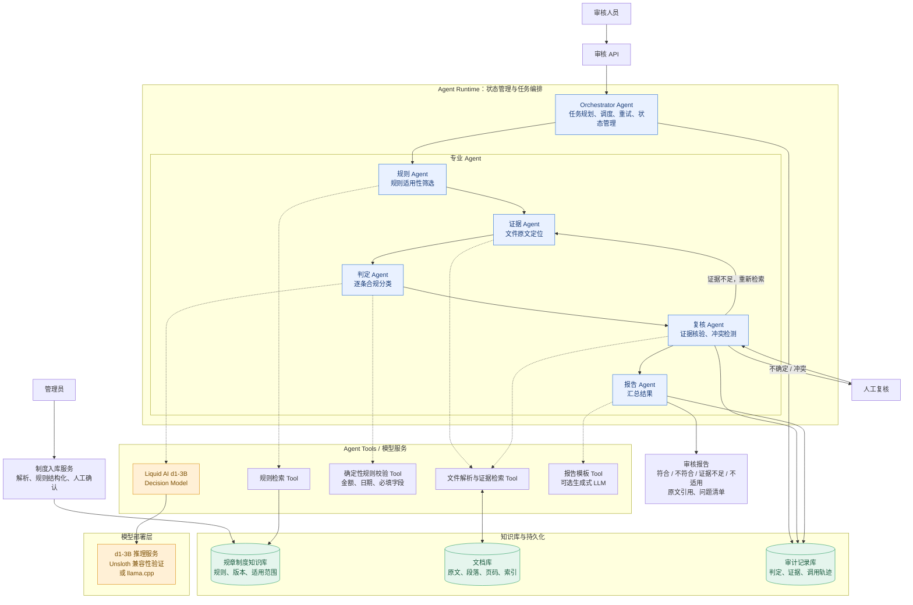

```mermaid
flowchart TB
    User["审核人员"] --> API["审核 API"]
    Admin["管理员"] --> Ingest["制度入库服务<br/>解析、规则结构化、人工确认"]

    subgraph Runtime["Agent Runtime：状态管理与任务编排"]
        direction TB
        O["Orchestrator Agent<br/>任务规划、调度、重试、状态管理"]

        subgraph Agents["专业 Agent"]
            direction LR
            R["规则 Agent<br/>规则适用性筛选"]
            E["证据 Agent<br/>文件原文定位"]
            D["判定 Agent<br/>逐条合规分类"]
            V["复核 Agent<br/>证据核验、冲突检测"]
            G["报告 Agent<br/>汇总结果"]

            R --> E --> D --> V --> G
            V -->|"证据不足，重新检索"| E
        end

        O --> R
    end

    API --> O

    subgraph Tools["Agent Tools / 模型服务"]
        direction LR
        T1["规则检索 Tool"]
        T2["文件解析与证据检索 Tool"]
        T3["确定性规则校验 Tool<br/>金额、日期、必填字段"]
        T4["Liquid AI d1-3B<br/>Decision Model"]
        T5["报告模板 Tool<br/>可选生成式 LLM"]
    end

    R -.-> T1
    E -.-> T2
    D -.-> T3
    D -.-> T4
    V -.-> T2
    G -.-> T5

    subgraph Storage["知识库与持久化"]
        direction LR
        KB[("规章制度知识库<br/>规则、版本、适用范围")]
        Docs[("文档库<br/>原文、段落、页码、索引")]
        DB[("审计记录库<br/>判定、证据、调用轨迹")]
    end

    Ingest --> KB
    T1 --> KB
    T2 <--> Docs
    O --> DB
    V --> DB
    G --> DB

    V -->|"不确定 / 冲突"| Human["人工复核"]
    Human --> V

    G --> Output["审核报告<br/>符合 / 不符合 / 证据不足 / 不适用<br/>原文引用、问题清单"]

    subgraph Deploy["模型部署层"]
        Model["d1-3B 推理服务<br/>Unsloth 兼容性验证<br/>或 llama.cpp"]
    end

    T4 --> Model

    classDef agent fill:#e9f1ff,stroke:#3375d6,color:#173a75
    classDef model fill:#fff0d6,stroke:#dc921c,color:#784c00
    classDef data fill:#e5f5ed,stroke:#36a36c,color:#17583b

    class O,R,E,D,V,G agent
    class T4,Model model
    class KB,Docs,DB data
```